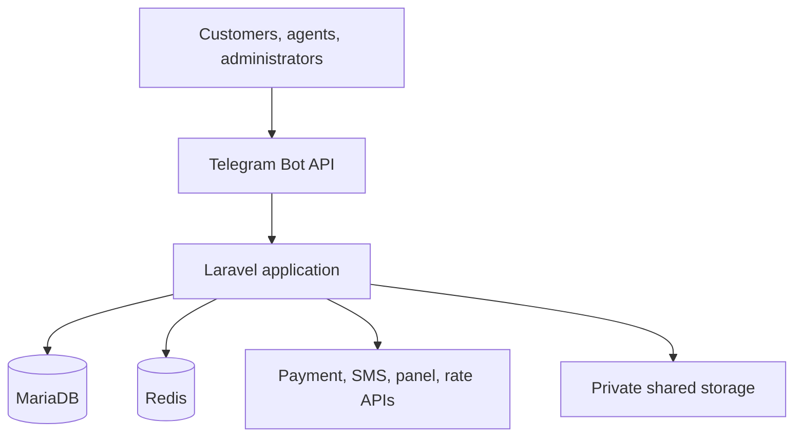

# Architecture Overview

**Decision baseline:** Laravel 13 modular monolith, PHP 8.4, MariaDB, Redis, Telegram-first presentation, atomic releases.

## How to read this document

This document contains both the target `1.0.0` architecture and the currently implemented module foundations. A target module or interface is not an implementation claim.

Status terms:

- `implemented`: production source, automated tests, and at least one accepted bounded evidence boundary exist;
- `candidate`: source/tests exist on the active branch but the current bounded increment is unverified;
- `foundation`: prerequisite primitives exist, but the complete Master Prompt workflow does not;
- `target`: planned architecture only.

Current live status remains in `PROJECT_STATUS.md` and `docs/project-status.json`. The exact working head always comes from PR `#6`.

## System context



Browser access is limited to installer, updater, restore, health, and provider callback routes. Telegram and HTTP controllers are adapters; neither contains domain rules. MariaDB is the source of truth. Redis provides queues, cache, rate limits, and coordination, but never the final financial or uniqueness guarantee.

## Runtime components

| Component | Responsibility | Correctness boundary | Current state |
|---|---|---|---|
| HTTP/LSPHP | Telegram webhook, provider callbacks, installer/updater/restore/health | Authenticate, validate, persist idempotently, acknowledge quickly | Telegram ingress and installer foundation implemented; later callbacks/updater/restore are target |
| CLI workers | Application commands, integrations, provisioning, delivery, reconciliation | Bounded retry; classify definitive/retryable/uncertain outcomes | worker/heartbeat foundation implemented; provisioning/delivery/reconciliation are later phases |
| Scheduler | Dispatch due work through one Cron entry | Database/Redis overlap prevention and recorded run history | runtime foundation verified; complete scheduled business operations are target |
| MariaDB | Durable state, constraints, ledger, outbox, audit | Final duplicate-effect and transaction boundary | current implemented modules use MariaDB; ledger is target Phase 0.5 |
| Redis | Queue, cache, throttles, distributed coordination | May be lost/restarted without violating durable invariants | queue/cache/rate-limit foundations implemented |
| Shared private storage | Receipts, ticket media, backups, provider certificates | Never web-exposed; restrictive ownership/permissions | installer/runtime layout foundation; complete retention/backup flows are target |

## Module boundaries

`Core` below is the logical name for framework-independent primitives and is implemented by the `App\Shared` namespace/path: identifiers, idempotency/outbox primitives, clocks, correlation, typed outcomes, and shared errors. It must not depend on a feature module.

Cross-module reads should use explicit queries/read models; cross-module mutations should use Application Services. Existing verified code may contain direct Query Builder reads across foundation tables. Those uses must be classified through a future table-ownership map before enforcement is tightened; this document does not pretend the stronger rule is already fully machine-enforced.

| Module | Owns | May depend on | Status at 2026-08-07 |
|---|---|---|---|
| `Core` / `Shared` | IDs, Money/fixed decimals, Clock, correlation, idempotency/outbox, base errors | Nothing feature-specific | foundation |
| `Identity` | users, Telegram identity, phone/OTP, identity evidence | Core, Notifications contracts | implemented in Phase 0.3 |
| `AccessControl` | administrators, roles, permissions, overrides, approvals | Core, Identity identifiers, Audit contract | implemented in Phase 0.3 |
| `Customers` | profiles, tiers, tags, account status | Core, Identity; read-only Orders metrics contract | implemented in Phase 0.3 |
| `Agents` | applications, profiles, pricing profiles/status | Core, Customers, AccessControl; Catalog identifiers | implemented lifecycle foundation in Phase 0.3 |
| `Catalog` | category/product/offering commercial configuration, routes, custom plans, trials | Core; Panels capability/capacity query | implemented through Custom Plan; Trial candidate unverified |
| `Panels` | panel connections, targets, capabilities, capacity, health, adapters | Core, Operations health contracts | inventory/capacity implemented; adapter candidate unverified |
| `Orders` | quotes, orders/items, price snapshots, guarded order state | Core, Catalog, Customers/Agents policy queries, Promotions pricing contract | target Phase 0.5/0.6 |
| `Payments` | methods/rules, intents/attempts, provider evidence, refunds | Core, Orders command contract, Wallet payment contract, Operations outbox | target Phase 0.5 |
| `Wallet` | ledger accounts/transactions/entries, holds, transfers, balance snapshots | Core, Identity identifiers, Operations outbox | target Phase 0.5 |
| `Provisioning` | operations/attempts, target selection orchestration | Core, Orders paid-state query, Panels adapter, Services command contract | target Phase 0.6; Panel coordinator is not full provisioning |
| `Services` | subscriptions, remote identities, lifecycle, sync, delivery artifacts | Core, Catalog identifiers, Panels capabilities, Operations outbox | target Phase 0.6 |
| `Promotions` | discounts, gift codes, reservations/redemptions | Core, Catalog/Customer identifiers, Wallet credit contract | target Phase 0.5 |
| `Referrals` | attribution, rules, pending/released/reversed rewards | Core, Identity/Orders identifiers, Wallet credit contract | target Phase 0.5/0.7 |
| `Support` | tickets, messages, attachments, assignment | Core, Identity identifiers, AccessControl policies, Notifications | target Phase 0.7 |
| `Broadcast` | campaigns, audiences, recipient/message lifecycle | Core, Customers query contract, Notifications/Telegram delivery contract | target Phase 0.7 |
| `Content` | translations/overrides, menus, custom buttons/resources | Core, audience-policy query contracts | localization files exist; complete content system is target Phase 0.7 |
| `Notifications` | notification requests, delivery policy and attempts | Core; transport ports only | scattered foundations; complete module is target |
| `Reporting` | permission-scoped read models/exports | Read-only contracts or replicas/views; never feature writes | target Phase 0.8 |
| `Operations` | outbox, idempotency, audit, alerts, health, task runs | Core; exposes infrastructure ports to modules | runtime/release/heartbeat foundation implemented |
| `Installer` | one-time preflight/bootstrap journal | Configuration/migration ports; not domain internals | foundation verified in Phase 0.2 |
| `Updater` | signed release staging, activation, rollback journal | Release/backup/health ports; not feature tables directly | target; release activation primitives exist under Operations/deploy |
| `Telegram` | webhook/update dispatch, conversations, callbacks, keyboards | Application Services only | ingress/update foundation implemented; complete UX is target Phase 0.7 |

## Layer layout and dependency direction

A feature module may contain:

```text
app/Modules/<Module>/
├── Domain/
├── Application/
│   ├── Contracts/
│   ├── Exceptions/
│   └── Jobs/
├── Infrastructure/
└── Presentation/
    ├── Console/
    └── Http/
```

Intended direction:

- Domain imports only its module Domain and reviewed shared abstractions;
- Application orchestrates domain behavior and declared ports;
- Infrastructure implements persistence/provider/framework ports;
- Presentation validates transport shape and calls Application services;
- a module must not import another module's Infrastructure/Eloquent model;
- events/outbox do not hide synchronous invariants that require one MariaDB transaction.

### Current enforcement reality

`scripts/ci/architecture.sh` currently rejects important Domain/framework/Infrastructure violations and selected transport/provider misuse. It does **not yet fully prove**:

- the complete module dependency graph;
- absence of every Application-to-foreign-Infrastructure import;
- table ownership and direct cross-module writes;
- Presentation-to-Application-only invocation;
- all dependency cycles;
- consistency between target and implemented module declarations.

The project-control audit tracks this as finding F-010. Tightening enforcement must begin with detection/classification and bounded exceptions, not an unreviewed rewrite of verified services.

## Command and side-effect flow

```mermaid
sequenceDiagram
    participant P as Presentation
    participant A as Application Service
    participant D as MariaDB
    participant O as Outbox Worker
    participant E as External API
    P->>A: Validated command + actor + idempotency key
    A->>D: Begin; lock/check; mutate; enqueue outbox; commit
    A-->>P: Committed result
    O->>D: Claim outbox record
    O->>E: Idempotent/adoptable operation
    E-->>O: Definitive, retryable, or uncertain result
    O->>D: Persist outcome and next action
```

An external call is not held inside a long database transaction. Before the call, the intended operation is durably recorded. After the call, the outcome is persisted. An uncertain result enters query/discovery/reconciliation, not blind retry.

The active Phase 0.4 Panel Adapter candidate implements this result/discovery model around a Fake adapter and unavailable real-provider shells. It is not accepted evidence of a full Outbox worker, Provisioning aggregate, or real provider compatibility.

## Financial invariants

These are target release invariants. Their primitives may exist before the owning phases, but final acceptance belongs to Phase 0.5/0.6.

1. Payment provider evidence can change payment state only through `Payments` Application Services.
2. Only authoritative `captured` state may authorize paid provisioning. Browser return, Telegram message, uploaded image, validation-only response, and provider `pending` are not capture.
3. Capture and provider-transaction consumption occur in one MariaDB transaction with unique constraints.
4. One order may have multiple controlled intents, but at most one captured settlement completes it. Competing intents are canceled or sent to review.
5. Ledger postings are append-only and balanced; cached balances are derived. Holds change available balance once; capture/release is mutually exclusive and idempotent.
6. Cumulative refunds cannot exceed refundable captured value; the exact card adjustment is excluded.
7. Each paid order item has at most one active remote service identity. Payment remains successful if provisioning fails.
8. Redis locks reduce contention only. Database row locks, transitions, and uniqueness decide correctness.

The required concrete uniqueness and transaction recipes are specified in `14-data-model-and-erd.md` and the Master Prompt; they must be reconciled with actual Phase 0.5/0.6 migrations when those phases begin.

## Remote-effect invariants

These apply now to the Panel Adapter foundation:

1. authoritative lookup occurs immediately before create;
2. exact remote match is adopted;
3. mismatch becomes conflict/manual review;
4. unavailable authoritative lookup means no create;
5. timeout/uncertain create triggers discovery before any further create;
6. conflicting idempotency-key reuse never overwrites the original operation result;
7. TLS verification remains enabled; custom CA/pinning is explicit and scoped;
8. sensitive delivery artifacts and credentials are never serialized into ordinary logs/evidence.

## Error taxonomy

| Class | Meaning | Default handling | Current implementation note |
|---|---|---|---|
| `ValidationError` | Input or domain rule violated | Reject safely; no retry | module-specific exceptions/value validation exist |
| `AuthorizationError` | Actor lacks permission/policy | Deny, audit sensitive attempts; no retry | Phase 0.3 services implement execution-time checks |
| `ConflictError` | Current state/version/unique ownership conflicts | Return current result or manual review | replay/version/remote mismatch controls exist in bounded modules |
| `DefinitiveProviderError` | Provider confirms failure | Persist failure; policy-defined user/manual action | SMS and Panel result types provide foundations |
| `RetryableProviderError` | Explicit temporary failure before side effect | Bounded backoff with jitter/circuit breaker | target complete integration behavior |
| `UncertainProviderResult` | Timeout/lost response may hide side effect | Query by idempotency/deterministic identity; reconcile | active Panel candidate implements discovery logic |
| `SecurityViolation` | Signature, SSRF, tamper, or policy attack | No state effect; security audit/alert/rate limit | controls are distributed; central taxonomy remains future work |
| `InvariantViolation` | financial, ownership, or state invariant broken | stop affected automation; Critical alert and review | database failures/manual review patterns exist; full Operations response is target |

A single central exception hierarchy has not yet been completed. Do not claim it from this table.

## Consistency and concurrency

- Use short MariaDB transactions and an explicit lock order documented by the owning increment.
- Commands carry an operation key unique within a defined scope. An exact duplicate returns the stored result, not a fresh action.
- Payload/fingerprint mismatch under the same operation key fails closed and preserves the original effect.
- Optimistic versions protect conversations and ordinary configuration; `SELECT ... FOR UPDATE` protects capacity, state transitions, competing reviews, and future money.
- Isolation-sensitive tests run on MariaDB, not SQLite. Deadlocks are retried only around the complete idempotent transaction.
- Outbox records are inserted in the same transaction as the state they announce. Delivery consumers store their own deduplication result.
- Redis locks reduce work duplication but never replace durable uniqueness/transaction barriers.

## Security boundaries

- Telegram webhook uses the configured secret token; update IDs are unique. Callback tokens will be opaque, expiring, actor/action-bound, and replay-safe when full conversation UX is implemented.
- Provider callbacks verify signatures on raw bodies before parsing business data, store event identity, then queue processing.
- Generic external URLs pass the SSRF policy on initial resolution and every redirect. TLS certificate and hostname verification is mandatory.
- Secrets are accepted only by installer/protected actions, encrypted or referenced, never returned in full, and redacted from logs/outbox/audit payloads.
- PII access is permission-scoped, masked by default, audited when revealed/exported, and governed by `08-data-classification.md`.
- Private files are outside `public/`; access is by authorized resend/streaming, never a storage path.
- A fake or unavailable shell is a test/fail-closed mechanism, not proof of a real provider contract.

## Deployment architecture

Target release layout:

- immutable code: `releases/<version>`;
- durable data: `shared/.env`, `shared/storage`, backups, packages, certificates, installer lock;
- `current` atomic symlink; OpenLiteSpeed exposes only `current/public`;
- CLI PHP and LSPHP preflighted independently;
- one Cron invokes Scheduler; supervised workers consume isolated queues;
- database migrations use expand/contract compatibility; code rollback is blocked when schema metadata says it is unsafe.

Current implementation includes release-switch, installer, runtime, worker, and heartbeat foundations with Phase 0.2 staging evidence. It does not mean every target update/restore/production package command in the runbooks is currently executable. See runbook status banners and `docs/development/staging-workflow-inventory.md`.

## Known unknowns

- Exact installed Marzban/PasarGuard versions and capabilities require live contract checks.
- Real automatic bank and gift-card provider schemas and authority guarantees are not supplied.
- Owner thresholds for high-value/dual approval, production SLO/load, RPO/RTO, and final retention/legal policy remain deployment decisions.
- Telegram and payment provider current contracts must be re-verified against official documentation during implementation.
- The module dependency/table ownership map and full architecture enforcement remain stabilization/hardening work.
- Current active Trial/Panel candidate must pass exact-head implementation and evidence gates before being listed as implemented.

See ADRs `0001` through `0005`, `docs/31-project-control-plane-audit.md`, and the current traceability/risk overlays for decisions and open gaps.
