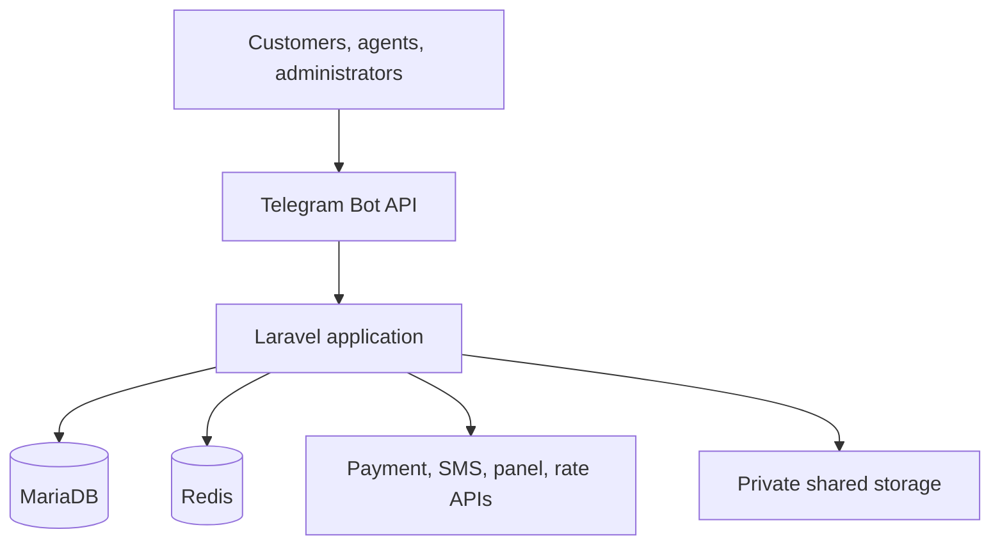

# Architecture Overview

**Decision baseline:** Laravel 13 modular monolith, PHP 8.4, MariaDB, Redis, Telegram-first presentation, atomic releases.

## System context



Browser access is limited to installer, updater, restore, health, and provider callback routes. Telegram and HTTP controllers are adapters; neither contains domain rules. MariaDB is the source of truth. Redis provides queues, cache, rate limits, and coordination, but never the final financial or uniqueness guarantee.

## Runtime components

| Component | Responsibility | Correctness boundary |
|---|---|---|
| HTTP/LSPHP | Telegram webhook, provider callbacks, installer/updater/restore/health | Authenticate, validate, persist idempotently, acknowledge quickly |
| CLI workers | Application commands, integrations, provisioning, delivery, reconciliation | Bounded retry; classify definitive/retryable/uncertain outcomes |
| Scheduler | Dispatch due work through one Cron entry | Database/Redis overlap prevention and recorded run history |
| MariaDB | Durable state, constraints, ledger, outbox, audit | Final duplicate-effect and transaction boundary |
| Redis | Queue, cache, throttles, distributed coordination | May be lost/restarted without violating financial invariants |
| Shared private storage | Receipts, ticket media, backups, provider certificates | Never web-exposed; restrictive ownership/permissions |

## Module boundaries

`Core` below is the logical name for framework-independent primitives and is implemented by the `App\\Shared` namespace/path: identifiers, `Money`, clock, correlation, typed outcomes, and domain errors. It must not depend on a feature module. Cross-module reads use explicit queries/read models; cross-module mutations use Application Services. Direct writes to another module's tables are forbidden.

| Module | Owns | May depend on |
|---|---|---|
| `Core` | IDs, Money/fixed decimals, Clock, correlation, base errors | Nothing feature-specific |
| `Identity` | users, Telegram identity, phone/OTP, identity evidence | Core, Notifications contracts |
| `AccessControl` | administrators, roles, permissions, overrides, approvals | Core, Identity identifiers, Audit contract |
| `Customers` | profiles, tiers, tags, account status | Core, Identity; read-only Orders metrics contract |
| `Agents` | applications, profiles, pricing profiles/status | Core, Customers, AccessControl; Catalog identifiers |
| `Catalog` | category/product/offering/server commercial configuration | Core; Panels capability query |
| `Panels` | panel connections, targets, capabilities, health, adapters | Core, Operations health contracts |
| `Orders` | quotes, orders/items, price snapshots, guarded order state | Core, Catalog, Customers/Agents policy queries, Promotions pricing contract |
| `Payments` | methods/rules, intents/attempts, provider evidence, refunds | Core, Orders command contract, Wallet payment contract, Operations outbox |
| `Wallet` | ledger accounts/transactions/entries, holds, transfers, balance snapshots | Core, Identity identifiers, Operations outbox |
| `Provisioning` | operations/attempts, target selection orchestration | Core, Orders paid-state query, Panels adapter, Services command contract |
| `Services` | subscriptions, remote identities, lifecycle, sync, delivery artifacts | Core, Catalog identifiers, Panels capabilities, Operations outbox |
| `Promotions` | discounts, gift codes, reservations/redemptions | Core, Catalog/Customer identifiers, Wallet credit contract |
| `Referrals` | attribution, rules, pending/released/reversed rewards | Core, Identity/Orders identifiers, Wallet credit contract |
| `Support` | tickets, messages, attachments, assignment | Core, Identity identifiers, AccessControl policies, Notifications |
| `Broadcast` | campaigns, audiences, recipient/message lifecycle | Core, Customers query contract, Notifications/Telegram delivery contract |
| `Content` | translations/overrides, menus, custom buttons/resources | Core, audience-policy query contracts |
| `Notifications` | notification requests, delivery policy and attempts | Core; transport ports only |
| `Reporting` | permission-scoped read models/exports | Read-only contracts or replicas/views; never feature writes |
| `Operations` | outbox, idempotency, audit, alerts, health, task runs | Core; exposes infrastructure ports to all modules |
| `Installer` | one-time preflight/bootstrap journal | Configuration/migration ports; not domain internals |
| `Updater` | signed release staging, activation, rollback journal | Release/backup/health ports; not feature tables directly |
| `Telegram` | webhook/update dispatch, conversations, callbacks, keyboards | Application Services only |

### Dependency enforcement

- Domain code imports only its module Domain plus `Core` abstractions.
- Application code may orchestrate declared module contracts; it does not import another module's Infrastructure/Eloquent models.
- Infrastructure implements repository/provider ports and may use Laravel, Eloquent, HTTP, Redis, and filesystem APIs.
- Presentation validates transport shape and calls Application Services.
- Architecture tests will reject imports from `Infrastructure` into `Domain`, direct provider clients outside adapters, and direct Telegram/HTTP use in business services.
- Cycles are broken with a port owned by the caller or a domain event/outbox message. Events are not used to hide synchronous invariants that require one database transaction.

## Command and side-effect flow

```mermaid
sequenceDiagram
    participant P as Presentation
    participant A as Application Service
    participant D as MariaDB
    participant O as Outbox Worker
    participant E as External API
    P->>A: Validated command + actor + idempotency key
    A->>D: Begin; lock/check; mutate; enqueue outbox; commit
    A-->>P: Committed result
    O->>D: Claim outbox record
    O->>E: Idempotent/adoptable operation
    E-->>O: Definitive, retryable, or uncertain result
    O->>D: Persist outcome and next action
```

An external call is not held inside a long database transaction. Before the call, the intended operation is durably recorded. After the call, the outcome is persisted. An uncertain result enters query/discovery/reconciliation, not blind retry.

## Financial invariants

1. Payment provider evidence can change payment state only through `Payments` Application Services.
2. Only authoritative `captured` state may authorize paid provisioning. Browser return, Telegram message, uploaded image, validation-only response, and provider `pending` are not capture.
3. Capture and provider-transaction consumption occur in one MariaDB transaction with unique constraints.
4. One order may have multiple controlled intents, but at most one captured settlement completes it. Competing intents are canceled or sent to review.
5. Ledger postings are append-only and balanced; cached balances are derived. Holds change available balance once; capture/release is mutually exclusive and idempotent.
6. Cumulative refunds cannot exceed refundable captured value; the exact card adjustment is excluded.
7. Each paid order item has at most one active remote service identity. Payment remains successful if provisioning fails.
8. Redis locks reduce contention only. Database row locks, transitions, and uniqueness decide correctness.

The required concrete uniqueness and transaction recipes are specified in `14-data-model-and-erd.md`.

## Error taxonomy

| Class | Meaning | Default handling |
|---|---|---|
| `ValidationError` | Input or domain rule violated | Reject safely; no retry |
| `AuthorizationError` | Actor lacks permission/policy | Deny, audit sensitive attempts; no retry |
| `ConflictError` | Current state/version/unique ownership conflicts | Return current result or manual review |
| `DefinitiveProviderError` | Provider confirms failure | Persist failure; policy-defined user/manual action |
| `RetryableProviderError` | Explicit temporary failure before side effect | Bounded backoff with jitter/circuit breaker |
| `UncertainProviderResult` | Timeout/lost response may hide side effect | Query by idempotency/deterministic identity; reconcile |
| `SecurityViolation` | Signature, SSRF, tamper, or policy attack | No state effect; security audit/alert/rate limit |
| `InvariantViolation` | Financial, ownership, or state invariant broken | Stop affected automation; Critical alert and review |

## Consistency and concurrency

- Use short MariaDB transactions and explicit row-lock order: aggregate root first, then reservation/consumption record, then ledger accounts sorted by ID.
- Commands carry an operation key unique within a defined scope. A duplicate returns the stored result, not a fresh action.
- Optimistic versions protect conversations and ordinary configuration; `SELECT ... FOR UPDATE` protects money, capacity reservations, state transitions, and competing reviews.
- Isolation-sensitive tests run on MariaDB, not SQLite. Deadlocks are retried only around the complete idempotent transaction.
- Outbox records are inserted in the same transaction as the state they announce. Delivery consumers store their own deduplication result.

## Security boundaries

- Telegram webhook uses the configured secret token; update IDs are unique. Callback tokens are opaque, expiring, actor/action-bound, and replay-safe.
- Provider callbacks verify signatures on raw bodies before parsing business data, store event identity, then queue processing.
- Generic external URLs pass the SSRF policy on initial resolution and every redirect. TLS certificate and hostname verification is mandatory.
- Secrets are accepted only by installer/protected actions, encrypted or referenced, never returned in full, and redacted from logs/outbox/audit payloads.
- PII access is permission-scoped, masked by default, audited when revealed/exported, and governed by `08-data-classification.md`.
- Private files are outside `public/`; access is by authorized resend/streaming, never a storage path.

## Deployment architecture

- Immutable code: `releases/<version>`.
- Durable data: `shared/.env`, `shared/storage`, backups, packages, certificates, installer lock.
- `current` is an atomic symlink; OpenLiteSpeed exposes only `current/public`.
- CLI PHP and LSPHP are preflighted independently.
- One Cron invokes Scheduler; supervised workers consume isolated queues.
- Database migrations use expand/contract compatibility. Code rollback is blocked when schema metadata says it is unsafe.

See ADRs `0001` through `0005` for the decisions and consequences.

## Known unknowns

- Exact installed Marzban/PasarGuard versions and capabilities require live contract checks.
- Real automatic bank and gift-card provider schemas and authority guarantees are not supplied.
- Owner thresholds for high-value/dual approval, production SLO/load, RPO/RTO, and final retention/legal policy remain deployment decisions.
- Telegram and payment provider current contracts must be re-verified against official documentation during implementation; this design does not claim those integrations have been tested.
