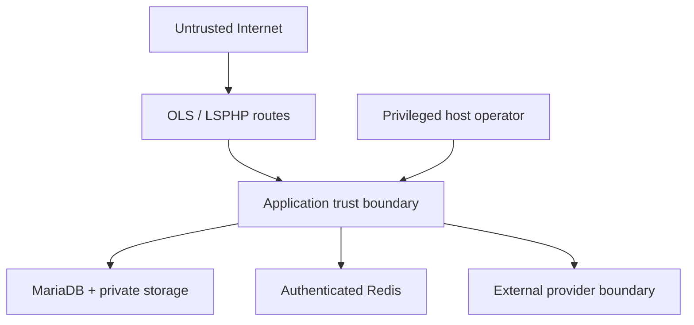

# Security Threat Model

**Method:** asset/trust-boundary analysis with STRIDE-style threats and abuse cases.  
**Status:** design review only; controls and tests below are required, not yet evidenced.

## Scope and security objectives

Protected objectives, in order:

1. Financial integrity: no unauthorized, duplicate, unbalanced, or untraceable effect.
2. Authorization and ownership integrity: users see/operate only their data; administrators receive least privilege.
3. Provisioning integrity: no service before authoritative payment and no duplicate remote service.
4. Confidentiality: secrets, identity data, gift codes, receipt evidence, and subscription material remain private.
5. Recoverability and auditability: signed releases, authenticated backups, append-only evidence, deterministic reconciliation.
6. Availability: provider, Telegram, Redis, or worker failure degrades safely without corrupting durable state.

Out of scope for application-only guarantees: compromise of the host/root account, Telegram client account, a provider itself, or the Owner's endpoint. These remain in the model because the application must limit blast radius and detect inconsistencies.

## Trust boundaries

- All Telegram updates and provider callbacks are hostile until authenticated and validated.
- Administrator identity does not make configuration content trustworthy; URLs, mappings, files, and templates remain constrained.
- Queue payloads and cached values are replayable/untrusted inputs. Durable state is re-read before action.
- Provider “success” is accepted only under the provider-specific authority contract and local hard constraints.
- Backups and release packages cross storage/transport boundaries and require cryptographic verification.

## Assets

| Asset | Primary concern | Required protection |
|---|---|---|
| Ledger/payment/refund records | Integrity, non-repudiation | Append-only posting, constraints, reconciliation, audit |
| Provider transaction/redemption IDs | Uniqueness | Canonical normalization and unique consumption |
| Bot/provider/DB/Redis credentials and signing keys | Confidentiality, rotation | Secret input, encryption/reference, least privilege, no output/logging |
| Phone, card, national ID, receipts, gift codes | Confidentiality, minimization | Encryption, keyed hashes, masking, access audit, retention |
| Subscription URLs/tokens | Confidentiality | Encryption, redaction, narrow delivery |
| Administrator permissions | Integrity | Default deny, deny precedence, cache invalidation, audit |
| Release and backup artifacts | Integrity/confidentiality | Signature/checksum, authenticated encryption, separate key custody |
| Audit and reconciliation evidence | Integrity/availability | Append-only access, retention, backup |

## Threat catalogue

| ID | Threat / attack path | Security control | Required verification | Residual concern |
|---|---|---|---|---|
| `THR-001` | Forge Telegram webhook | HTTPS, secret-token comparison, method/content-type/body limit, unique update ID | Forged/missing token and duplicate update tests | Token theft requires rotation |
| `THR-002` | Replay or steal callback token | Random opaque token, actor/chat/action binding, expiry, one-time or replay-safe record, state/permission re-check | Cross-user, expired, repeated-click tests | Telegram account compromise |
| `THR-003` | Administrator impersonation or privilege escalation | Telegram identity binding, default deny, multi-role/deny precedence, per-action authorization, signed confirmation, optional dual approval | Horizontal/vertical IDOR and permission-cache tests | Owner endpoint compromise |
| `THR-004` | Duplicate payment/manual approval/refund | Scoped idempotency key, guarded row transition, unique consumption/capture/refund key, row locks | Concurrent callback/admin/refund tests | Provider identity instability |
| `THR-005` | Forged receipt or screenshot | Treat as evidence only; authoritative bank transaction or human review with limits/reason/audit | Duplicate image/file and approval-race tests | Social engineering of reviewer |
| `THR-006` | Malicious bank/gift payload | Signature before parse, schema/type/size limits, safe mappings, canonical hash, escape output | Oversized/malformed/duplicate/out-of-order tests | Compromised signed provider |
| `THR-007` | SSRF/DNS rebinding through configurable endpoint or import link | Central egress policy described below; registered panel domains only for imports | IPv4/IPv6/private/redirect/rebinding tests | Application cannot replace host egress firewall |
| `THR-008` | Gift-card code theft/reuse | TLS, encrypted code, keyed hash uniqueness, mask after entry, reveal permission/audit, authoritative reserve/capture | Log/display leakage and concurrent redemption tests | Code used outside platform before capture |
| `THR-009` | OTP brute force/enumeration/cost abuse | Hashed code, expiry, attempt/cooldown/daily limits by multiple keys, generic response, no logging | Rate limit, expiry, replay, fallback tests | Distributed low-rate abuse |
| `THR-010` | SQL/injection or unsafe generic mappings | Parameterized Eloquent/Query Builder; allowlisted transforms; no executable templates/SQL/shell | Static forbidden-pattern and injection tests | Dependency-level flaws |
| `THR-011` | Installer/updater XSS, CSRF, session fixation | CSRF, secure cookie/session rotation, strict output encoding, CSP/security headers, short-lived setup token, lock after install | Browser security tests | Host admin browser compromise |
| `THR-012` | Telegram HTML/Markdown injection | Central renderer, placeholder allowlist, escape dynamic values, validate markup | Malicious names/content tests | Bot API rendering differences |
| `THR-013` | File upload/parser/path traversal | Private storage, random server name, content sniffing, size/type allowlist, no execution, safe Telegram download, malware hook | Polyglot, traversal, oversized, executable tests | Zero-day in media parser |
| `THR-014` | Secret/log/report leakage | Structured allowlist logging, redaction by type, masked views, encrypted raw payload only when necessary, secret scan | Negative leakage tests over logs/jobs/reports/artifacts | Human screenshots outside system |
| `THR-015` | Panel MITM | HTTPS, hostname verification, managed custom CA/pin for self-signed, no `verify=false` | Invalid CA/hostname tests | Pin rotation outage |
| `THR-016` | Compromised provider sends false success | Authoritative status re-query, local amount/currency/order/destination checks, approval ceiling, reconciliation/circuit breaker | Mismatch and reversal tests | A fully compromised authority remains business risk |
| `THR-017` | Queue replay or stale command | Operation key, aggregate version/state re-read, unique effect, bounded retry/dead letter | Replay/crash tests | Queue flood availability |
| `THR-018` | Race on wallet, exact amount, discount, capacity, provisioning | MariaDB locks/constraints; Redis only advisory; deterministic lock order | Real MariaDB concurrency tests | Deadlocks handled by whole-command retry |
| `THR-019` | Malicious update/supply chain | Signed manifest, checksum, locked dependencies, audit/license scan, immutable staging, fixed commands | Tamper/incompatible package tests | Signing-key compromise |
| `THR-020` | Backup theft/tamper or restore poisoning | Authenticated encryption, separate key, checksums/manifests, isolated validation, authorization, restore audit | Wrong key/tamper/full restore tests | Backup-key loss |
| `THR-021` | Sensitive data in outbox/failed jobs/cache | Store identifiers and minimal payload; encrypt unavoidable restricted fields; expire cache; sanitize exception data | Storage inspection tests | Operator DB access |
| `THR-022` | Brute force/denial of service | Per-user/IP/provider/global limits, bounded input, circuit breakers, queue isolation, alert aggregation | Burst/backlog tests | Volumetric DDoS needs upstream controls |

## SSRF control design

All outbound URLs derived from configuration or user input use one central `SafeEndpoint`/egress client:

1. Parse strictly; permit `https` only; reject user-info, fragments, ambiguous encodings, malformed/overlong hostnames, and non-approved ports.
2. Reject IP literals by default. If the Owner explicitly approves an IP for a private panel, it belongs to a separate fixed panel configuration, never Generic REST.
3. Normalize the IDNA hostname and enforce an optional provider-specific domain allowlist.
4. Resolve all IPv4 and IPv6 answers. Reject if any answer is loopback, private, link-local, carrier-grade NAT, multicast, documentation, benchmark, reserved, unspecified, or cloud metadata range.
5. Connect only to the validated resolved address while sending the normalized hostname for TLS SNI and certificate verification. Do not perform an unchecked second DNS resolution in the HTTP library.
6. Disable redirects by default. When a contract needs them, allow a small fixed count and repeat all checks for every target; never forward credentials to a different origin.
7. Set connect/overall timeouts, response byte limit, content-type allowlist, and decompression expansion limit.
8. Host/network egress rules should independently deny internal and metadata networks. Application checks are defense in depth, not a firewall substitute.

Service-import links do not fetch the submitted URL. They are parsed to identify an already registered panel/service domain, then queried through that panel's configured adapter.

## Secret lifecycle

- Entry: browser installer secret control, protected administrator action, hidden interactive Artisan prompt, or mode-`0600` temporary file. Never chat, URL, command argument, commit, fixture, screenshot, or issue.
- Storage: environment for bootstrap secrets; encrypted application value or external reference for rotatable provider secrets. The encryption key is not stored beside exported ciphertext.
- Use: reveal only to the adapter needing it; prevent serialization into jobs/events; zeroization is best-effort in PHP and not claimed as a hard guarantee.
- Display: saved secrets are write-only; show status/fingerprint/last-tested time, never the full value.
- Logs: centralized context sanitizer and allowlisted provider summaries; raw request/response is off by default.
- Rotation: store candidate, test without exposing, atomically switch reference, verify, then revoke predecessor; audit actor and timestamps.
- Backup: secrets excluded where practical; if required for recovery, encrypted under a separate documented key policy. Signing and backup keys have distinct custody.

## Authorization rules

- Customer ownership filters are applied in repositories/policies, not only Telegram navigation.
- Administrator permission is evaluated at execution time. An explicit per-administrator deny overrides all role grants.
- Sensitive operations bind confirmation token to actor, action, target, normalized parameters, current version, and expiry.
- Dual approval, when configured, requires two distinct authorized administrators; the requester cannot approve the same action twice.
- Reveal/export, permission changes, payment decisions, wallet corrections, ownership transfer, provider/secret changes, backup/restore/update/rollback are audited.
- Audit records are append-only to normal application roles; the database application user should not receive routine delete/update rights on finalized ledger/audit records where deployability permits.

## Financial abuse controls

- Hard matches (settled state, exact amount, currency/unit, destination, time, unconsumed transaction) cannot be overridden by a score.
- Automatic amount/risk ceilings route to human review. Manual approval is still subject to state, uniqueness, authorization, and optional dual approval.
- Gift-card validation without reservation/redemption does not create authoritative payment capture.
- A reversal after provisioning creates a Critical incident; automation freezes affected action scopes. History is compensated, not deleted.
- Provider callback and later authoritative status disagreement favors the more conservative state and reconciliation; it never silently provisions.

## Privacy and retention

Classification, masking, encryption, keyed hashing, and provisional retention are in `08-data-classification.md`. Financial/audit evidence is retained append-only according to approved legal/business policy; raw provider payloads and private media are not retained merely for convenience. Legal hold prevents cleanup and is audited.

## Release-blocking findings policy

Block the phase/release for:

- any failing financial, authorization, remote-idempotency, backup integrity, or restore control;
- a known exploitable Critical/High issue without effective mitigation;
- disabled TLS verification, reachable installer after lock, unsigned/unverified update, plaintext secret in artifacts, or arbitrary executable mapping;
- inability to distinguish authoritative capture from pending/user-return/validation-only evidence.

## Unresolved inputs

Real provider signature algorithms, replay windows, status semantics, certificate requirements, and authority guarantees must be documented from current official contracts and contract-tested before activation. Final legal retention, dual-approval thresholds, trusted provider domains, and host-level egress policy require Owner/deployment input. No implementation or test completion is asserted here.
