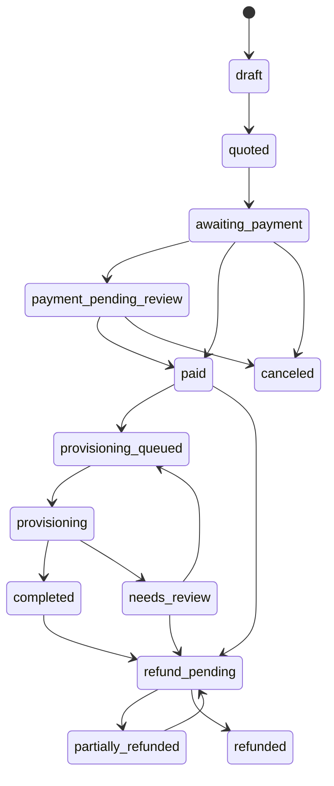
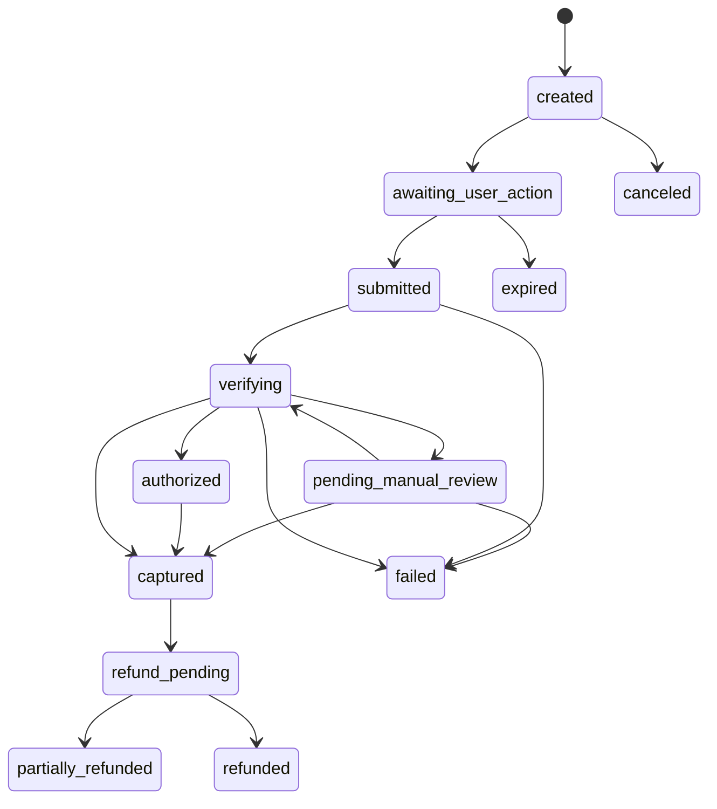
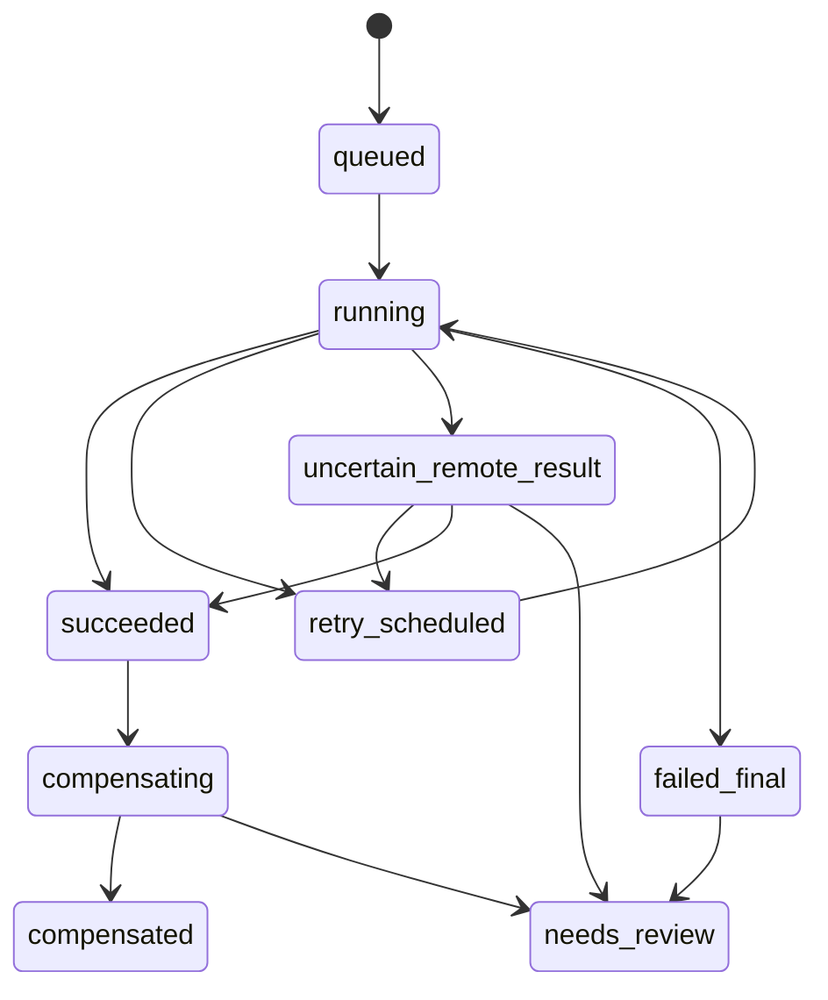
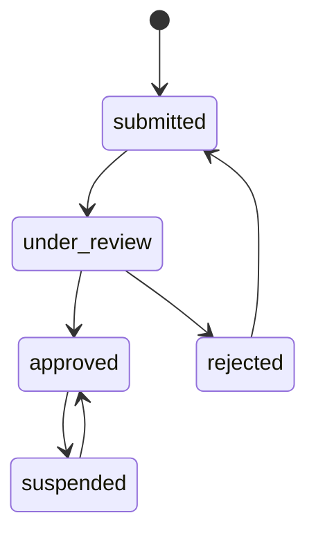

# State Machines

All transitions are performed by typed transition services. A status is never updated directly by a controller, job, adapter, or administrator. Every transition records actor/system identity, reason code, correlation ID, prior/new state, and timestamp where the aggregate history requires it. Duplicate commands return the recorded outcome.

## Cross-machine invariants

- Paid provisioning requires `PaymentIntent=captured` and `Order=paid|provisioning_queued|provisioning`; trial/gift/admin-grant sources carry an explicit non-paid authorization instead.
- `PaymentIntent=captured` is irreversible. Refund is represented by refund state and ledger compensation, never by changing capture to failed.
- Provisioning failure does not undo payment capture or cause a second collection.
- Order completion requires all required items to have succeeded/delivered or an explicit reviewed terminal outcome for the order type.
- External `pending`, browser return, receipt submission, gift-card validation-only, and Telegram delivery are not authoritative financial success.
- Terminal state does not mean record deletion; financial and audit histories remain immutable.

## Order

| From | To | Authorized actor | Guard / effect |
|---|---|---|---|
| `draft` | `quoted` | Customer/agent/admin application service | Valid item configuration and immutable price snapshot; quote expiry set |
| `quoted` | `awaiting_payment` | Buyer application service | Quote still valid; eligibility rechecked; order and items fixed |
| `awaiting_payment` | `payment_pending_review` | Payments service | Submitted evidence/pending policy; no capture/provisioning |
| `awaiting_payment`, `payment_pending_review` | `paid` | Payments service only | One intent authoritatively captured or explicit zero-cost source authorized; competing capture blocked |
| `paid` | `provisioning_queued` | Order orchestration | Outbox provisioning command committed once per item |
| `provisioning_queued` | `provisioning` | Provisioning service | Worker claims at least one pending operation idempotently |
| `provisioning` | `completed` | Provisioning/order orchestration | Required item operations succeeded and delivery policy satisfied/recorded |
| `provisioning` | `needs_review` | Provisioning/reconciliation | Final/uncertain conflict or retry exhausted; payment remains captured |
| `needs_review` | `provisioning_queued` | Authorized repair/reconciliation service | Conflict resolved or safe retry approved; reuse the existing per-item operation identity |
| `needs_review` | `refund_pending` | Authorized refund service | Provisioning cannot be completed and refund policy/amount is confirmed |
| `draft`, `quoted`, `awaiting_payment`, `payment_pending_review` | `canceled` | Buyer/system/authorized admin | No captured settlement; release reservations/holds exactly once |
| `paid`, `completed` | `refund_pending` | Authorized refund service | Refund request within refundable captured amount and policy |
| `refund_pending` | `partially_refunded`, `refunded` | Refund service/provider evidence | Atomic refund posting; cumulative amount constrained |

Expiry is a reasoned transition to `canceled` for an unpaid order. A late payment is handled by payment review and never by reopening an order through direct status edit.

## Payment Intent

| Transition family | Guard |
|---|---|
| Create/present | One active intent per method/attempt policy and stable creation idempotency key; amount/currency/order snapshot fixed |
| `submitted -> verifying` | Evidence persisted privately; provider or manual workflow selected |
| `verifying -> authorized` | Provider supports authorization distinct from capture and authoritative response matches intent |
| `verifying|authorized -> captured` | Signature/authority verified; amount, currency/unit, order, destination and unique external transaction match; capture+consumption atomic |
| `verifying -> pending_manual_review` | Ambiguous, high-risk, validation-only, late, mismatch eligible for review, or provider uncertainty/fallback |
| `pending_manual_review -> verifying` | Authorized reviewer requests a fresh authoritative provider check; no financial effect has occurred |
| `pending_manual_review -> captured` | Authorized decision invokes the same capture service and all amount/uniqueness/optional dual-approval guards pass |
| `pending_manual_review -> failed` | Authorized rejection with mandatory reason or definitive provider evidence; no prior capture |
| Nonterminal -> `failed` | Definitive failure only; uncertain result is not failure |
| Eligible noncaptured -> `expired|canceled` | Expiry/user/admin policy; release reservations/holds once; late evidence remains reviewable |
| `captured -> refund_pending -> partially_refunded|refunded` | Authorized request; provider/manual evidence; cumulative refundable ceiling; ledger compensation |

`captured`, `refunded`, and fully terminal failed/canceled/expired intents are not reopened. Out-of-order provider events are stored and reconciled without regressing state.

## Provisioning operation

- `queued -> running`: claim the unique operation for one order item/action; verify payment/source authorization and current capability.
- `running -> uncertain_remote_result`: timeout/lost response where remote side effect may exist. Next step is deterministic lookup/status, never immediate create.
- `uncertain_remote_result -> succeeded`: matching remote identity is found and adopted after attribute verification.
- `uncertain_remote_result -> needs_review`: remote identity conflicts or absence cannot be established safely.
- `running -> retry_scheduled`: explicitly retryable failure and bounded attempts remain.
- `running -> failed_final`: definitive permanent failure or retry budget exhausted; paid order moves to review.
- Compensation is an explicit, idempotent remote operation; it never erases original attempt history.

## Gift-card submission/redemption

| From | To | Guard |
|---|---|---|
| — | `submitted` | Type policy satisfied; code hash uniqueness checked where code exists; private media persisted |
| `submitted` | `validating` | Provider attempt created with idempotency key |
| `validating` | `invalid`, `already_used`, `expired` | Authoritative definitive provider result |
| `validating` | `valid_unreserved` | Validity/balance confirmed but value is not locked; cannot capture payment |
| `validating` | `reserved` | Provider atomically reserves value for this intent |
| `reserved` | `redeeming` | Idempotent capture command persisted |
| `redeeming` | `captured` | Authoritative redemption identity and value persisted uniquely with payment capture |
| Any nonterminal | `pending_manual_review` | Unknown/mismatch/provider unavailable/high risk/image-only without authority |
| `reserved` | `released` | Intent canceled/expired and provider confirms release |
| `validating` | `provider_unavailable` | Circuit open or definitive availability failure; fallback policy decides review |
| `pending_manual_review` | `rejected` | Authorized reviewer, mandatory reason, no prior capture |

Concurrent provider/manual decisions share the same unique redemption/financial-effect barrier.

## Wallet hold

| State | Allowed next | Guard/effect |
|---|---|---|
| `active` | `captured` | Lock hold/account; amount unchanged; post purchase debit and consume hold once |
| `active` | `released` | Lock hold/account; restore available amount once; no purchase debit |
| `active` | `expired` | Scheduler uses the same release transaction with expiry reason |
| `captured`, `released`, `expired` | none | Duplicate command returns original outcome |

Creation of `active` hold locks affected wallet accounts in deterministic order and rejects insufficient available balance. Capture and release are mutually exclusive under a unique hold operation key and guarded row version.

## Agent application

- Only one active (`submitted`/`under_review`) application per customer.
- Claiming records reviewer and version; another reviewer cannot silently overwrite the claim.
- Approval atomically creates/activates the agent profile and assigns a pricing profile.
- Reapplication from `rejected` requires cooldown expiry or audited manual release.
- Suspend/restore preserves profile, price history, orders, and financial data.

## Ticket

| From | Allowed next | Actor/guard |
|---|---|---|
| `new` | `awaiting_support`, `investigating` | Routing/authorized support claim |
| `awaiting_support` | `investigating`, `awaiting_customer`, `resolved` | Assigned/authorized support |
| `awaiting_customer` | `awaiting_support`, `investigating`, `resolved` | Customer reply or support action |
| `investigating` | `awaiting_customer`, `awaiting_support`, `resolved` | Support; reason/internal note as applicable |
| `resolved` | `closed`, `awaiting_support` | Customer/system close or reopen within policy |
| `closed` | `awaiting_support` | Customer within default 72-hour window or authorized support override |

Ticket messages are append-only; duplicate replies use a client/action idempotency key. State changes do not delete assignment/message history.

## Service subscription

The normalized local service lifecycle is `pending_activation`, `active`, `suspended`, `expired`, `retired`, or `needs_review`. Provider-specific labels are mapped to these states without inventing unsupported semantics.

| From | Allowed next | Guard/effect |
|---|---|---|
| `pending_activation` | `active`, `needs_review` | Verified provisioning result or reconciliation conflict |
| `active` | `suspended`, `expired`, `retired`, `needs_review` | Capability/policy check; remote result verified before local finalization |
| `suspended` | `active`, `expired`, `retired`, `needs_review` | Authorized activation or verified remote state |
| `expired` | `active`, `retired`, `needs_review` | Successful renewal operation or explicit retirement |
| `needs_review` | `active`, `suspended`, `expired`, `retired` | Structured reconciliation with before/after evidence |
| `retired` | none | Terminal local state; history, remote identity, financial links, and audit retained |

Remote missing/deleted does not silently retire a paid service; it enters `needs_review`. Delete/retire, link rotation, plan/location/protocol change, renewal, and add-ons are separate idempotent `service_operations`, not direct state/field edits.

## Broadcast campaign and recipient

Campaign states: `draft -> scheduled|running -> paused -> running -> completed`; `draft|scheduled|running|paused -> canceled`. A scheduled campaign is immutable after its launch snapshot except through an audited new version. Owner test-send is required before launch policy permits it.

Recipient states: `queued -> sending -> sent|failed_transient|failed_permanent|skipped`; `failed_transient -> queued` only through bounded retry. Unique `(campaign_id,user_id)` prevents duplicate recipient creation. A sent recipient stores the actual Telegram message ID; edit/pin/unpin/delete are separate idempotent lifecycle operations and do not change original send truth.

## Review rules

- State enums and transition matrices are version-controlled.
- Administrative override uses a dedicated repair/reconciliation command; it cannot bypass uniqueness, ledger, or authoritative payment requirements.
- Unknown remote outcomes are represented explicitly. Mapping them to failure or retry without discovery is forbidden.
- Transition tests must cover allowed/denied actor, prior state, replay, concurrency, and out-of-order events on MariaDB where locks matter.
