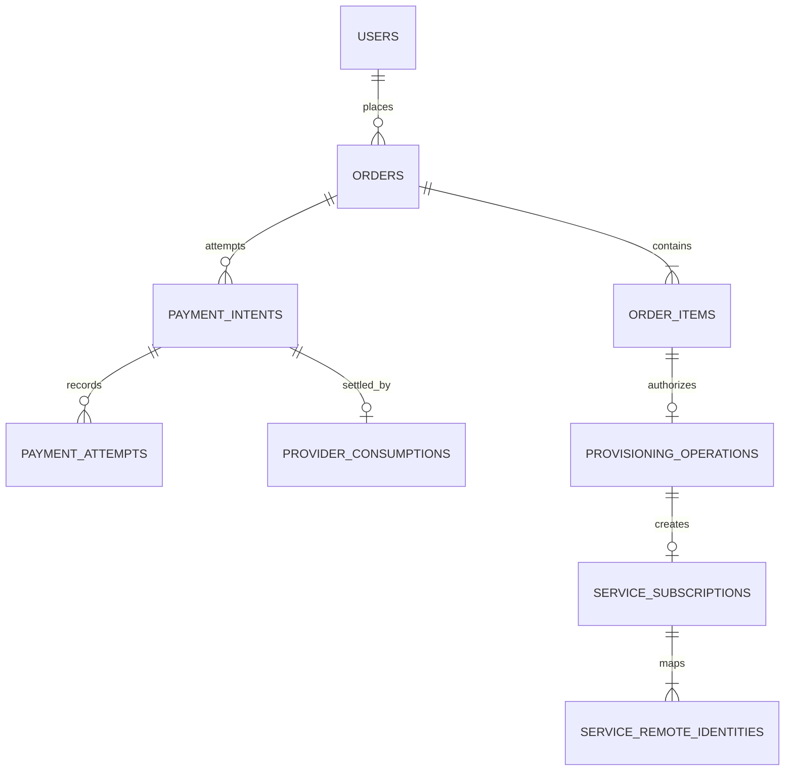
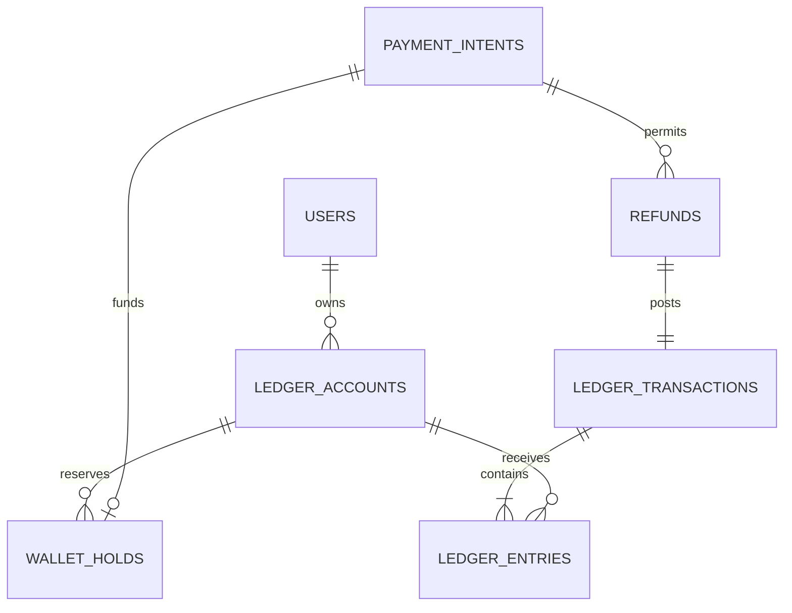

# Data Model and ERD

**Database:** MariaDB, `utf8mb4`, UTC timestamps.  
**Status:** logical schema baseline; migration names and physical types may be refined without weakening these constraints.

## Modeling conventions

- Internal primary keys are unsigned `BIGINT`; externally exposed references use random opaque IDs or UUIDv7 where enumeration is a concern.
- Foreign keys are mandatory for relational ownership. No unenforced generic `type/id` polymorphic association is used for financial or security-critical data.
- Status columns use typed application enums plus database check constraints supported by the target MariaDB version.
- Fiat is integer `BIGINT` IRR; crypto is fixed `DECIMAL`, never float. Currency and unit are explicit.
- All timestamps are UTC with application-level immutable creation/finalization timestamps. Tehran/Jalali formatting belongs to presentation.
- Financial, provider-consumption, order price snapshot, and audit rows are not soft- or hard-deleted. Other records use explicit archive/retire semantics only when the domain requires history.
- Sensitive values use encrypted columns plus versioned keyed hashes for exact lookup/uniqueness. No index is built over plaintext PII.
- JSON is limited to versioned, schema-validated snapshots or provider-safe metadata; queryable relations remain normalized.

## Core commerce relationship

`PROVIDER_CONSUMPTIONS` is a logical name covering a bank transaction, gift redemption, chain TXID, or gateway transaction linked uniquely to a capture. Provider-specific evidence remains in its normalized table.

## Ledger relationship

Every posted ledger transaction has at least two entries and a zero sum in one currency. A wallet balance snapshot is a cache/checkpoint, not authority.

## Aggregate ownership

| Aggregate/module | Principal tables | Integrity boundary |
|---|---|---|
| Identity/Customers | `users`, `telegram_accounts`, `customer_profiles`, tiers/history/tags, phones/verifications, OTP, identity items/reviews | Unique Telegram ID; one active verified phone claim; encrypted PII |
| Access/Agents | administrators, roles/permissions/joins/overrides/approvals; agent applications/profiles/pricing/history | Duplicate grants prevented; deny precedence; one active application |
| Catalog/Panels | categories, products, offerings, servers, panel connections/targets/capabilities/fallbacks/packages | Historical references archived, not deleted; typed capabilities |
| Orders | quotes, orders, items, price components | Immutable quote/order snapshot and guarded state/version |
| Payments | methods/rules/destinations, intents/attempts, provider transactions/events, submissions/reviews/refunds/reservations | Unique event/transaction/consumption; one captured settlement per order |
| Wallet | accounts, transactions, entries, holds, transfers, reconciliation runs | Balanced append-only postings; no negative available balance |
| Provisioning/Services | operations/attempts, subscriptions, remote identities, sync, delivery, imports/transfers/repairs/batches | One operation effect per item/action; one remote identity owner |
| Promotions/Referrals | code/rule/reservation/redemption/reward tables | Unique redemption/reservation effect; refund reverses pending reward |
| Support/Broadcast/Content | ticket/message/file; campaign/recipient/message; translations/menu versions | Ownership, append-only messages, one recipient per campaign/user |
| Operations | outbox, idempotency, processed updates, audit, alerts, task runs, health, backups/restores/releases | Unique delivery/update/action identities and append-only evidence |

## Mandatory keys and uniqueness

| Rule | Physical constraint pattern |
|---|---|
| Telegram update is processed once | `UNIQUE(bot_id, telegram_update_id)` on `processed_telegram_updates` |
| Telegram account identity | `UNIQUE(bot_id, telegram_user_id)`; Telegram username is not unique authority |
| One active verified phone owner | `phone_numbers.lookup_hash` identifies value; separate active claim row `UNIQUE(lookup_hash)` or nullable `active_lookup_hash UNIQUE`; release preserves verification history |
| One active agent application | Nullable `active_customer_id` populated only for submitted/review states with `UNIQUE(active_customer_id)`; cleared on terminal state in same transition transaction |
| Idempotent command | `UNIQUE(scope, key_hash)` on `idempotency_keys`; store request fingerprint, result reference and completion state |
| Provider webhook | `UNIQUE(provider_configuration_id, external_event_id)`; when no stable ID exists, unique canonical event hash under a documented scope |
| Provider transaction | `UNIQUE(provider_configuration_id, external_transaction_id)` |
| Payment intent key | `UNIQUE(order_id, method_id, creation_key)` |
| One settlement wins an order | A dedicated `order_settlements` row with `UNIQUE(order_id)` and `UNIQUE(payment_intent_id)`; inserted atomically with capture |
| One external transaction consumed once | Consumption row has `UNIQUE(provider_transaction_id)` and `UNIQUE(payment_intent_id)` for non-partial v1 settlement |
| Bank transaction identity | `UNIQUE(bank_provider_id, external_transaction_id)` and webhook event equivalent |
| Gift code reuse | `UNIQUE(scope_id, code_lookup_hash)` for submission; `UNIQUE(provider_id, external_redemption_id)` and one consumption row |
| USDT TXID | Canonical network + transaction hash `UNIQUE(chain_id, normalized_txid)` |
| Active exact amount | Nullable `active_collision_key VARBINARY(32) UNIQUE`; key covers destination, payable IRR, and matching-window scope while active; set `NULL` on release/expiry, preserving history |
| Manual decision once | `UNIQUE(payment_intent_id, decision_effect_type)` or one guarded review decision row; two reviewers race on locked intent |
| Wallet operation once | `UNIQUE(wallet_account_id, operation_type, operation_key)` on hold/transfer/posting reference |
| Discount/code/referral effect once | Unique reservation/redemption/reward operation keys plus per-code/user constraints |
| Provision once | `UNIQUE(order_item_id, operation_type, operation_version)` and one active service identity per item |
| Remote service owner | `UNIQUE(panel_connection_id, external_remote_id)` and `UNIQUE(panel_connection_id, normalized_username)` where the panel's namespace requires it |
| Campaign recipient once | `UNIQUE(campaign_id, user_id)`; outbound lifecycle action unique by recipient message + action/version |
| Outbox event once | `event_uuid UNIQUE`; consumer effect has its own operation key—`published_at` alone is not an exactly-once guarantee |

MariaDB does not provide a general partial unique index. Nullable “active key” columns or dedicated claim tables are used for active-only uniqueness; transition services update the claim and history atomically. Generated-column behavior and target MariaDB version must be verified in migration tests before relying on it.

## Critical transaction recipes

### Capture an external payment

1. Begin MariaDB transaction and acquire the idempotency row.
2. Lock `payment_intent` then `order` in stable order.
3. Re-read state; a completed duplicate returns the existing settlement.
4. Lock/upsert normalized provider transaction and validate signature-derived evidence, status, amount/unit/currency, order, destination, and expiry/late policy.
5. Insert unique provider consumption and unique order settlement.
6. Transition intent to `captured`, order to `paid`, and post any top-up ledger transaction.
7. Insert provisioning/notification outbox events.
8. Commit. A uniqueness conflict is resolved by loading the winning result, not repeating effects.

No external call occurs inside this transaction. The authoritative provider query result is persisted before/with the transition as appropriate.

### Wallet hold and capture

1. Begin; lock wallet ledger accounts sorted by ID and the idempotency key.
2. Derive available balance from posted entries minus active holds (or verify reconciled snapshot under the same locks).
3. Insert the unique active hold only if sufficient; never permit a negative available amount.
4. Capture locks the hold and related order/intent, inserts balanced ledger entries, marks hold captured, captures intent/settles order, and creates outbox records in one transaction.
5. Release/expiry locks the same hold and records one terminal outcome without a purchase debit.

### Exact-amount allocation

1. Lock or serialize the destination/window allocation scope; generate adjustment using injected cryptographic randomness.
2. Attempt insert with `active_collision_key = H(destination_id|payable_amount_irr|window_scope)` under a unique index.
3. On duplicate, retry with a bounded number of unused values. If exhausted, deny/fallback rather than collide.
4. Show only the stored base/adjustment/payable values. Expiry clears the active key in a guarded transition; late evidence remains linked for review.

### Provision an order item

1. Atomically insert/claim the unique provisioning operation after verifying captured settlement or explicit non-paid source.
2. Commit the intent before the remote call.
3. Call adapter with deterministic identifier/idempotency key where supported.
4. On success, transactionally persist verified remote identity, service subscription and delivery outbox.
5. On timeout/unknown response, record `uncertain_remote_result`; query by remote ID/deterministic username and adopt matching service. Conflicting attributes enter manual review.

### Manual versus automatic review race

Both paths lock the same payment intent and provider consumption candidate, execute the same capture service, and compete on the same unique constraints. The loser receives the already-recorded result. Review UI state never authorizes capture by itself.

### Double-entry posting

`ledger_transactions` begins as `building`. All entries are inserted in the same transaction using integer amounts and one currency. The posting service verifies debit total equals credit total and only then sets `posted_at`; database permissions/application guards forbid mutation of posted entries. Cross-row balance cannot be guaranteed by a simple check constraint, so reconciliation independently recomputes every transaction and account. A mismatch is Critical and freezes affected automated operations.

## Lock ordering and isolation

- Default stable order: idempotency key/aggregate root, then payment/order, then provider consumption/reservation, then ledger accounts sorted by ID, then outbox.
- Use `SELECT ... FOR UPDATE` for payment capture, wallet balance/hold, exact-amount claim, discount claim, capacity claim, manual decision, and ownership transfer.
- Ordinary content/configuration uses optimistic `version` comparison.
- Retry deadlocks around the complete idempotent Application Service with bounded jitter; never retry only a suffix of a financial transaction.
- Redis locks reduce duplicate worker effort but their expiry/loss must not bypass MariaDB constraints.

## Indexing baseline

- All foreign keys have supporting indexes.
- Operational composite indexes follow actual predicates: `(status, next_attempt_at)`, `(provider_id,status,occurred_at)`, `(destination_id,status,payable_amount_irr,expires_at)`, `(queue,status,available_at)`, `(service_id,created_at)`, `(campaign_id,state,id)`.
- Searchable identifiers use keyed hashes or normalized exact columns; wildcard scans over encrypted PII are not supported.
- Large broadcast, log, transaction, and sync tables use keyset pagination. Partition/archive only after measured query plans justify it.

## Data integrity and deletion

- Foreign key deletion defaults to `RESTRICT` for financial/history parents. Cascades are limited to ephemeral child records whose loss cannot erase evidence.
- Archived catalog/provider configuration retains identifiers referenced by snapshots and historical orders.
- Raw payload/media retention may expire, but normalized provider identity, payload hash, decisions, capture/consumption, and audit remain according to approved policy.
- Restore validation checks ledger balance, captured intent/settlement link, provider-consumption uniqueness, order/provisioning consistency, and service remote ownership before workers resume.

## Schema unknowns requiring validation

- Target MariaDB exact version, check-constraint behavior, generated columns, JSON behavior, collation, and transaction isolation must be captured by installer preflight and migration tests.
- Provider transaction identifiers, maximum lengths, case sensitivity, and normalization are contract-specific.
- Partial gift-card capture is excluded unless an explicit allocation model and provider guarantee are approved; v1 uniqueness assumes one captured gift-card value funds one payment.
- Final data retention does not alter relational integrity but controls cleanup/anonymization migrations.
